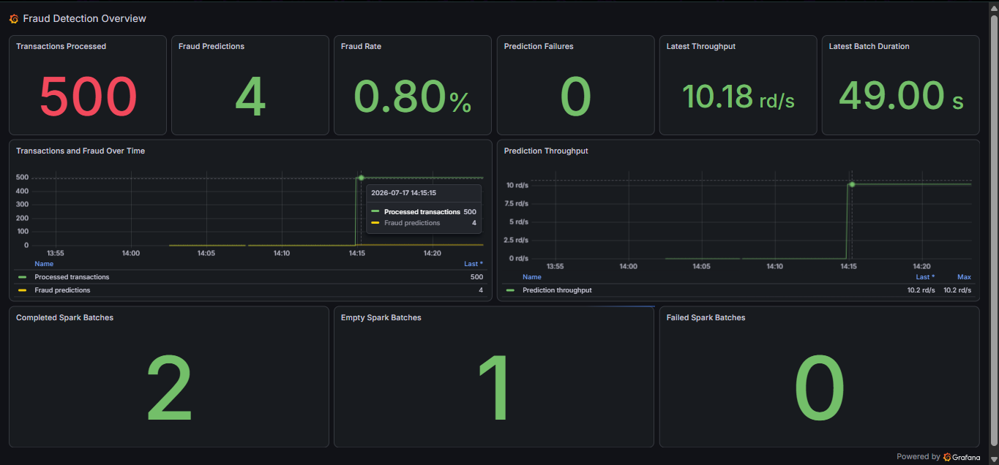
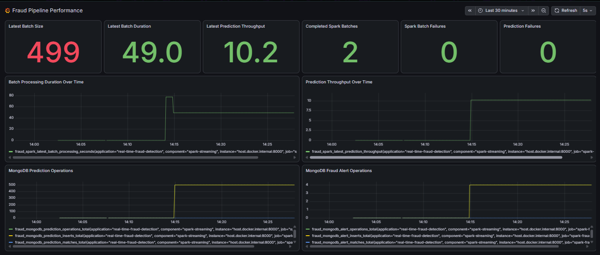
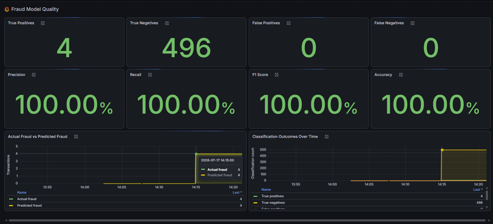

# Real-Time Financial Fraud Detection Pipeline

An end-to-end machine learning and real-time streaming system for detecting
fraudulent financial transactions using the PaySim dataset, Apache Kafka,
Spark Structured Streaming, MongoDB, Prometheus, Grafana, Python, and Docker.

The system streams financial transactions through Kafka, applies a trained
Random Forest classifier inside Spark micro-batches, stores prediction results
and fraud alerts in MongoDB, and exposes operational and model-quality metrics
through Prometheus and Grafana.

---

## Project Overview

Financial fraud detection requires more than training a machine learning
model. A complete system must also receive transactions continuously, score
them reliably, store the results, expose failures, and make operational and
model-quality information visible.

This project implements that complete workflow:

```text
PaySim CSV dataset
        |
        v
Python Kafka producer
        |
        v
Kafka topic: transactions
        |
        v
Spark Structured Streaming
        |
        v
Feature preparation
        |
        v
Random Forest fraud prediction
        |
        +-----------------------------+
        |                             |
        v                             v
MongoDB                         Prometheus metrics
        |                             |
        +-- prediction_history        v
        +-- fraud_alerts             Grafana
```

The project supports repeatable testing by assigning deterministic transaction
IDs and allowing the producer to start from a selected dataset row.

---

## Project Status

| Component | Status |
|---|---|
| Data understanding and validation | Completed |
| Exploratory data analysis | Completed |
| Data cleaning | Completed |
| Feature engineering | Completed |
| Model training and comparison | Completed |
| Random Forest model serialization | Completed |
| Kafka producer | Completed |
| Kafka consumer | Completed |
| Producer start-row support | Completed |
| Producer range validation tests | Completed |
| Spark Structured Streaming consumer | Completed |
| Spark fraud-prediction integration | Completed |
| MongoDB prediction persistence | Completed |
| MongoDB fraud-alert storage | Completed |
| Prometheus application metrics | Completed |
| Prometheus Docker service | Completed |
| Grafana Docker service | Completed |
| Fraud Detection Overview dashboard | Completed |
| Fraud Pipeline Performance dashboard | Completed |
| Fraud Model Quality dashboard | Completed |
| Live 2,000-transaction validation | Completed |
| Dashboard validation reports | Completed |
| Final repository documentation | Completed |

---

## Technology Stack

| Area | Technology |
|---|---|
| Programming language | Python 3.12 |
| Dataset | PaySim |
| Data processing | pandas, NumPy |
| Machine learning | scikit-learn |
| Message streaming | Apache Kafka |
| Kafka client | kafka-python |
| Stream processing | PySpark 3.5.1 |
| Database | MongoDB 7 |
| MongoDB client | PyMongo |
| Metrics | prometheus-client |
| Monitoring | Prometheus and Grafana |
| Infrastructure | Docker Compose |
| Development environment | Windows, PowerShell, VS Code |
| Testing | pytest |

The complete dependency list is maintained in:

```text
requirements.txt
```

---

## Dataset

The project uses the PaySim synthetic financial transaction dataset.

| Dataset metric | Value |
|---|---:|
| Total transactions | 6,362,620 |
| Fraud transactions | 8,213 |
| Non-fraud transactions | 6,354,407 |
| Fraud rate | 0.1291% |

Fraud occurs only in the following transaction types:

```text
TRANSFER
CASH_OUT
```

Because the dataset is highly imbalanced, accuracy alone is not sufficient for
evaluating the model. Precision, recall, F1 score, false positives, and false
negatives are also evaluated.

The dataset must be placed at:

```text
data/raw/paysim_transactions.csv
```

The full dataset is not committed to Git because of its size.

---

## Machine Learning Model

The final selected model is a Random Forest classifier.

| Model metric | Result |
|---|---:|
| Accuracy | 0.999997 |
| Precision | 1.000000 |
| Recall | 0.997565 |
| F1 score | 0.998781 |
| False positives | 0 |
| False negatives | 4 |

The model was selected after comparing classification results with particular
attention to false negatives, F1 score, and precision.

A false negative is especially important in fraud detection because it
represents an actual fraudulent transaction that was incorrectly classified
as normal.

---

## Repository Structure

```text
real_time_fraud_detection/
|
|-- data/
|   |-- raw/
|   |-- processed/
|   `-- predicted/
|
|-- docker/
|   `-- docker-compose.yml
|
|-- output_screenshots/
|   `-- Final validation screenshots
|
|-- models/
|   `-- saved_model/
|
|-- monitoring/
|   `-- grafana/
|       `-- dashboards/
|           |-- fraud-overview.json
|           |-- fraud-performance.json
|           `-- fraud-model-quality.json
|
|-- notebooks/
|   |-- 01_data_understanding.ipynb
|   |-- 02_eda_and_data_cleaning.ipynb
|   |-- 03_feature_engineering.ipynb
|   `-- 04_model_training.ipynb
|
|-- reports/
|
|-- src/
|   |-- database/
|   |   |-- connection.py
|   |   `-- mongodb_queries.py
|   |
|   |-- features/
|   |   `-- feature_engineering.py
|   |
|   |-- models/
|   |   |-- predict_fraud.py
|   |   `-- train_model.py
|   |
|   |-- monitoring/
|   |   |-- __init__.py
|   |   `-- metrics.py
|   |
|   |-- preprocessing/
|   |   `-- clean_data.py
|   |
|   `-- streaming/
|       |-- consumer.py
|       |-- producer.py
|       |-- spark_streaming_consumer.py
|       `-- spark_fraud_pipeline.py
|
|-- tests/
|   `-- test_producer_ranges.py
|
|-- requirements.txt
`-- README.md
```

Runtime directories such as Spark checkpoints, Python cache folders, and test
cache folders are not part of the project documentation or source code.

---

## File Guide

### Notebooks

#### `notebooks/01_data_understanding.ipynb`

Loads the PaySim dataset and examines its schema, transaction types, class
distribution, missing values, and general data quality.

#### `notebooks/02_eda_and_data_cleaning.ipynb`

Performs exploratory data analysis, studies fraud patterns, validates balance
columns, and prepares the cleaned dataset.

#### `notebooks/03_feature_engineering.ipynb`

Creates and evaluates model features such as transaction-type encoding,
balance differences, amount relationships, and error-based features.

#### `notebooks/04_model_training.ipynb`

Trains and compares machine learning models, evaluates classification metrics,
and documents the final Random Forest model selection.

### Preprocessing and feature engineering

#### `src/preprocessing/clean_data.py`

Provides reusable data-cleaning logic outside the notebooks.

#### `src/features/feature_engineering.py`

Creates the final model features consistently for training and real-time
prediction.

### Model files

#### `src/models/train_model.py`

Trains candidate models, compares evaluation metrics, selects the final model,
and saves the trained estimator and required feature metadata.

#### `src/models/predict_fraud.py`

Loads the saved Random Forest model, prepares an individual transaction, and
returns its prediction and fraud probability.

### Streaming files

#### `src/streaming/producer.py`

Reads PaySim records in chunks, adds a deterministic transaction ID and stream
timestamp, converts each transaction to JSON, and sends it to Kafka.

Important producer options include:

```text
--start-row
--limit
--sleep
```

The `--start-row` option allows repeatable, non-overlapping load tests.

#### `src/streaming/consumer.py`

Provides the Python Kafka consumer flow used for initial real-time fraud
prediction validation.

#### `src/streaming/spark_streaming_consumer.py`

Implements the initial Kafka-to-Spark Structured Streaming consumer and
micro-batch validation.

#### `src/streaming/spark_fraud_pipeline.py`

Implements the complete production-style streaming path:

```text
Kafka
→ Spark Structured Streaming
→ Random Forest prediction
→ MongoDB
→ Prometheus
```

It performs prediction inside `foreachBatch()`, writes prediction history and
fraud alerts, calculates batch metrics, and records confusion-matrix outcomes.

### Database files

#### `src/database/connection.py`

Manages MongoDB connections, indexes, prediction-history writes, fraud-alert
writes, and transaction-ID-based batch upserts.

#### `src/database/mongodb_queries.py`

Contains validation and analysis queries for prediction history, fraud alerts,
false positives, false negatives, and other stored prediction results.

### Monitoring

#### `src/monitoring/metrics.py`

Defines the Prometheus counters, gauges, and histograms used for monitoring:

- processed transactions;
- predicted fraud alerts;
- prediction failures;
- completed Spark batches;
- empty Spark batches;
- failed Spark batches;
- true positives;
- true negatives;
- false positives;
- false negatives;
- MongoDB prediction operations;
- MongoDB fraud-alert operations;
- latest batch size;
- latest processing duration;
- latest prediction throughput.

### Grafana dashboards

#### `monitoring/grafana/dashboards/fraud-overview.json`

Defines the **Fraud Detection Overview** dashboard.

It displays the overall transaction count, fraud predictions, fraud rate,
prediction failures, throughput, batch duration, and Spark batch status.

#### `monitoring/grafana/dashboards/fraud-performance.json`

Defines the **Fraud Pipeline Performance** dashboard.

It displays Spark processing duration, prediction throughput, batch status,
prediction failures, and MongoDB write operations.

#### `monitoring/grafana/dashboards/fraud-model-quality.json`

Defines the **Fraud Model Quality** dashboard.

It displays true positives, true negatives, false positives, false negatives,
precision, recall, F1 score, accuracy, actual fraud, predicted fraud, and
classification outcomes over time.

### Tests

#### `tests/test_producer_ranges.py`

Validates producer row-range logic, deterministic transaction IDs, argument
handling, and repeatable non-overlapping producer runs.

The current producer test suite contains 17 passing tests.

---

## MongoDB Storage

Database:

```text
fraud_detection_db
```

Collections:

```text
prediction_history
fraud_alerts
```

### `prediction_history`

Stores every successfully scored transaction with its transaction ID,
prediction, fraud probability, actual label, and processing information.

### `fraud_alerts`

Stores transactions where:

```text
prediction = 1
```

MongoDB writes use `transaction_id`-based upserts. Reprocessing an existing
transaction updates the stored document instead of creating uncontrolled
duplicates.

---

## Prometheus Metrics

The Spark process exposes application metrics at:

```text
http://localhost:8000/metrics
```

Prometheus collects these metrics and makes them available to Grafana.

The metrics include:

- processed transactions;
- predicted fraud alerts;
- prediction failures;
- completed, empty, and failed Spark batches;
- true positives and true negatives;
- false positives and false negatives;
- MongoDB prediction operations;
- MongoDB fraud-alert operations;
- latest batch size;
- latest batch-processing duration;
- latest prediction throughput;
- batch-duration histogram.

---

## Grafana Dashboards

Grafana is available at:

```text
http://localhost:3000
```

Three provisioned dashboards provide different views of the streaming system.

### Fraud Detection Overview

The **Fraud Detection Overview** dashboard presents the main operational
results, including processed transactions, predicted fraud, fraud rate,
prediction failures, latest throughput, latest batch duration, and Spark batch
status.

### Fraud Pipeline Performance

The **Fraud Pipeline Performance** dashboard focuses on processing efficiency
and storage activity. It displays Spark batch-processing duration, prediction
throughput, MongoDB prediction operations, fraud-alert operations, batch
activity, and failure indicators.

### Fraud Model Quality

The **Fraud Model Quality** dashboard presents true positives, true negatives,
false positives, false negatives, precision, recall, F1 score, accuracy, actual
fraud, predicted fraud, and classification outcomes over time.

Dashboard screenshots from the final 500-transaction validation run are
included in the **End-to-End Pipeline Evidence** section.

---

## Documentation Reports

Detailed implementation and validation evidence is stored in `reports/`.

| Report | Purpose |
|---|---|
| `model_training_report.md` | Model comparison, evaluation metrics, and final model selection |
| `kafka_streaming_report.md` | Kafka infrastructure, producer, topic, and streaming validation |
| `mongodb_integration_report.md` | MongoDB connection and persistence implementation |
| `mongodb_queries.md` | Queries for prediction-history and fraud-alert validation |
| `real_time_prediction_flow.md` | Python Kafka consumer, model prediction, and MongoDB flow |
| `end_to_end_pipeline_testing.md` | Complete Python pipeline testing |
| `spark_streaming_consumer_report.md` | Kafka-to-Spark consumer and micro-batch testing |
| `spark_fraud_prediction.md` | Random Forest prediction inside Spark |
| `spark_mongodb_integration.md` | Spark prediction persistence and fraud-alert validation |
| `grafana_performance_dashboard_validation.md` | Performance-dashboard and 2,000-record pipeline validation |
| `grafana_model_quality_dashboard_validation.md` | Model-quality metrics and dashboard validation |

The README provides the main project entry point. The reports preserve detailed
commands, outputs, troubleshooting notes, and implementation evidence without
making the README unnecessarily long.

---

## Installation

### 1. Clone the repository

```powershell
git clone https://github.com/Kapish196258/real_time_fraud_detection.git
cd real_time_fraud_detection
```

### 2. Create the virtual environment

```powershell
python -m venv venv
.\venv\Scripts\Activate.ps1
```

### 3. Install dependencies

```powershell
pip install -r requirements.txt
```

### 4. Add the dataset

Place the PaySim CSV at:

```text
data/raw/paysim_transactions.csv
```

### 5. Confirm Docker Desktop is running

Docker Desktop must be running before executing Docker Compose commands.

---

## Run the Complete Pipeline

The system should be run using separate PowerShell terminals.

### Terminal 1 — Start Docker services

```powershell
cd D:\Projects\real_time_fraud_detection
.\venv\Scripts\Activate.ps1

docker compose -f .\docker\docker-compose.yml up -d
docker compose -f .\docker\docker-compose.yml ps
```

Main service addresses:

| Service | Address |
|---|---|
| Kafka | `localhost:9092` |
| Kafka UI | `http://localhost:8080` |
| MongoDB | `localhost:27017` |
| Mongo Express | `http://localhost:8081` |
| Prometheus | `http://localhost:9090` |
| Grafana | `http://localhost:3000` |

### Terminal 2 — Start Spark

```powershell
cd D:\Projects\real_time_fraud_detection
.\venv\Scripts\Activate.ps1

python -m src.streaming.spark_fraud_pipeline --reset-checkpoint
```

Wait until Spark reports that it is waiting for transactions.

The module-based command must be used because the pipeline imports modules from
the project-level `src` package.

### Terminal 3 — Run the producer

Small smoke test:

```powershell
python .\src\streaming\producer.py `
    --start-row 0 `
    --limit 5 `
    --sleep 0.5
```

Repeatable 2,000-record load test:

```powershell
python .\src\streaming\producer.py `
    --start-row 8000 `
    --limit 2000 `
    --sleep 0.01
```

This load test generates transaction IDs:

```text
8001-10000
```

Use a new start row for every non-overlapping validation run.

---

## Verify the Pipeline

### Check Prometheus metrics

While Spark is running:

```powershell
Invoke-WebRequest `
    http://localhost:8000/metrics `
    -UseBasicParsing |
Select-Object -ExpandProperty Content |
Select-String "fraud_"
```

### Check model-quality metrics

```powershell
Invoke-WebRequest `
    http://localhost:8000/metrics `
    -UseBasicParsing |
Select-Object -ExpandProperty Content |
Select-String `
    "fraud_true_positives_total|fraud_true_negatives_total|fraud_false_positives_total|fraud_false_negatives_total"
```

### Check MongoDB collection counts

```powershell
docker exec fraud-mongodb mongosh fraud_detection_db --eval "
print(
    'Predictions:',
    db.prediction_history.countDocuments()
);
print(
    'Alerts:',
    db.fraud_alerts.countDocuments()
);
"
```

### Check a specific transaction range

```powershell
docker exec fraud-mongodb mongosh fraud_detection_db --eval "
print(
    'IDs 8001-10000:',
    db.prediction_history.countDocuments({
        transaction_id: {
            `$gte: 8001,
            `$lte: 10000
        }
    })
);
"
```

### Check Grafana health

```powershell
curl.exe http://localhost:3000/api/health
```

Expected result:

```text
database: ok
```

---

## Validated Live-Test Results

A repeatable 2,000-transaction test was completed using transaction IDs
8001-10000.

The final non-empty Spark batch produced:

| Metric | Result |
|---|---:|
| Successful predictions | 1,999 |
| Failed predictions | 0 |
| Actual fraud labels | 2 |
| Predicted fraud alerts | 2 |
| True positives | 2 |
| True negatives | 1,997 |
| False positives | 0 |
| False negatives | 0 |
| Prediction operations | 1,999 |
| Fraud-alert operations | 2 |
| Processing time | Approximately 199 seconds |
| Prediction throughput | Approximately 10 records/second |

The complete 2,000-record run was distributed across multiple Spark
micro-batches.

---

## End-to-End Pipeline Evidence

A final controlled validation run was completed to confirm that the full
streaming workflow operated correctly from transaction production to dashboard
monitoring.

The producer command was:

```powershell
python .\src\streaming\producer.py `
    --start-row 10000 `
    --limit 500 `
    --sleep 0.02
```

This configuration generated transaction IDs `10001–10500` from a new,
non-overlapping section of the PaySim dataset.

- `--start-row 10000` skipped the first 10,000 rows and prevented reuse of the
  earlier validation range.
- `--limit 500` restricted the run to exactly 500 streamed transactions.
- `--sleep 0.02` introduced a short delay between records to simulate a
  continuous transaction stream.
- Deterministic transaction IDs and MongoDB upserts supported repeatable tests
  without uncontrolled duplicate documents.

Spark Structured Streaming consumed the Kafka messages in micro-batches,
applied the trained Random Forest classifier, persisted prediction history and
fraud alerts in MongoDB, and published live operational and classification
metrics through Prometheus for Grafana visualization.

The validation run produced:

- 500 successful predictions;
- 4 predicted fraud alerts;
- 4 true positives;
- 496 true negatives;
- 0 false positives;
- 0 false negatives;
- 0 prediction failures;
- 500 MongoDB prediction-history operations;
- 4 MongoDB fraud-alert operations;
- 2 completed non-empty Spark batches;
- 1 expected initial empty batch;
- 0 failed Spark batches;
- a latest non-empty batch size of 499;
- a latest batch-processing duration of approximately 49 seconds;
- a latest prediction throughput of approximately 10.18 records per second.

The latest batch contained 499 records because Spark divided the complete
500-message stream across two non-empty micro-batches.

Kafka UI, MongoDB, and Prometheus were also checked during validation. Their
supporting screenshots are retained in `output_screenshots/`, while the README
presents only the three final Grafana dashboards to keep the project page clear
and concise.

### Fraud Detection Overview Dashboard

The Fraud Detection Overview dashboard summarizes processed transactions,
predicted fraud, fraud rate, prediction failures, throughput, batch duration,
and Spark batch status.



### Fraud Pipeline Performance Dashboard

The Fraud Pipeline Performance dashboard presents Spark processing duration,
prediction throughput, MongoDB prediction and alert operations, batch activity,
and pipeline failure indicators.



### Fraud Model Quality Dashboard

The Fraud Model Quality dashboard presents the confusion-matrix outcomes and
derived model-quality measures. For this selected 500-transaction range,
precision, recall, F1 score, and accuracy were all 100%, with four true
positives, 496 true negatives, and no false positives or false negatives.



These results apply to the selected validation range. They demonstrate that the
complete local pipeline operated correctly during the test, but they should not
be interpreted as guaranteed performance for every future transaction stream.

### Validation Flow

```text
PaySim dataset
→ Kafka producer
→ Kafka transactions topic
→ Spark Structured Streaming
→ Random Forest fraud prediction
→ MongoDB prediction history and fraud alerts
→ Prometheus application metrics
→ Grafana operational and model-quality dashboards
```

---

## Testing

Run the automated test suite from the project root:

```powershell
python -m pytest -v
```

The producer range-validation suite currently contains:

```text
17 passing tests
```

The tests validate:

- start-row behavior;
- transaction-ID generation;
- valid and invalid producer ranges;
- message limits;
- repeatable non-overlapping test execution.

---

## Shutdown

Stop the Spark pipeline with:

```text
Ctrl+C
```

Stop the Docker services:

```powershell
docker compose -f .\docker\docker-compose.yml down
```

To remove project volumes as well:

```powershell
docker compose -f .\docker\docker-compose.yml down -v
```

The volume-removal command deletes persisted Docker data and should be used
only when a complete reset is required.

---

## Limitations

- PaySim contains synthetic rather than real banking transactions.
- Fraud is highly imbalanced compared with non-fraud activity.
- Prometheus application counters reset when the Spark Python process restarts.
- The current model does not retrain automatically.
- Concept drift is not monitored.
- No external notification system is connected to fraud alerts.
- The pipeline is validated locally rather than on a production cluster.
- Large-scale Spark and MongoDB optimization remains possible.

---

## Troubleshooting

For common Docker, Kafka, Spark, MongoDB, Prometheus and Grafana issues, see the [Troubleshooting Guide](reports/troubleshooting_guide.md).

---

## Future Improvements

Possible future extensions include:

- automatic model retraining;
- model and data drift monitoring;
- email, SMS, or messaging alerts;
- cloud deployment;
- Kafka partition scaling;
- Spark cluster deployment;
- MongoDB sharding;
- authentication and access control;
- CI/CD pipelines;
- model registry integration;
- real financial institution data integration.

These improvements are outside the scope of the completed local end-to-end
project.

---

## Team Workflow

Before beginning work:

```powershell
git switch main
git pull origin main
```

After completing and testing a change:

```powershell
git status
git add <specific-files>
git diff --cached
git commit -m "Describe the completed work"
git push origin main
```

Specific files should be staged instead of using `git add .` so that
checkpoints, caches, logs, datasets, and unrelated files are not committed
accidentally.

Avoid force-pushing to `main`.

---

## Repository

```text
https://github.com/Kapish196258/real_time_fraud_detection
```